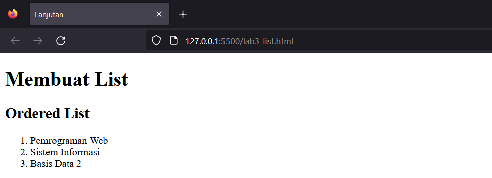
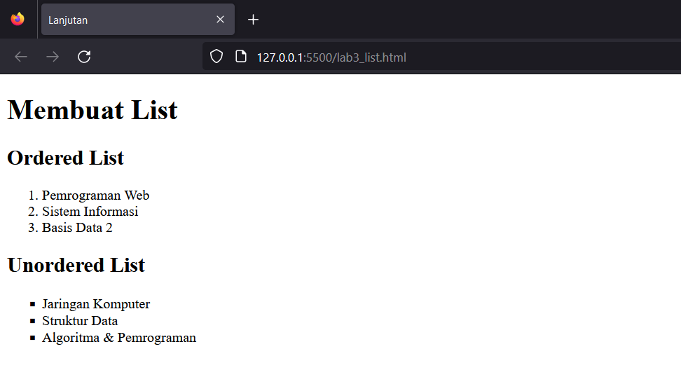
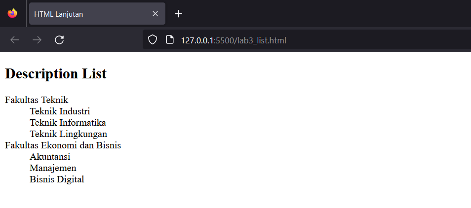
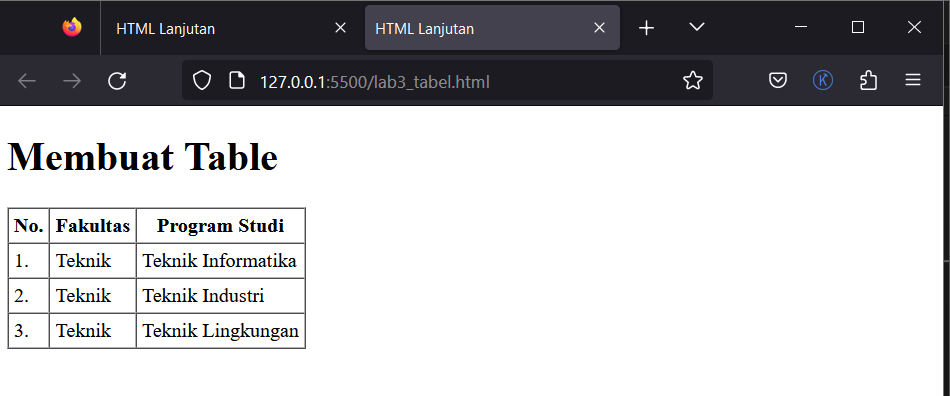
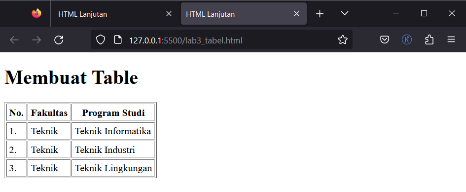
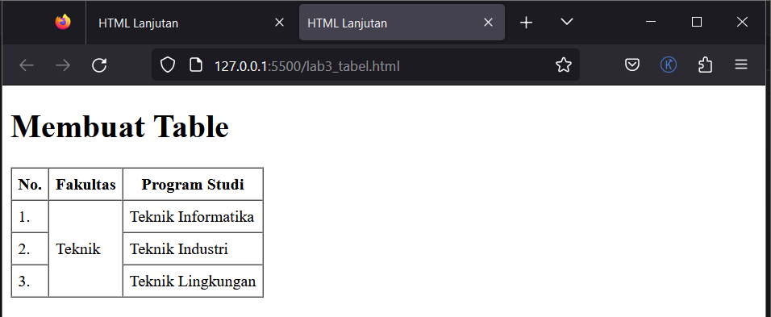
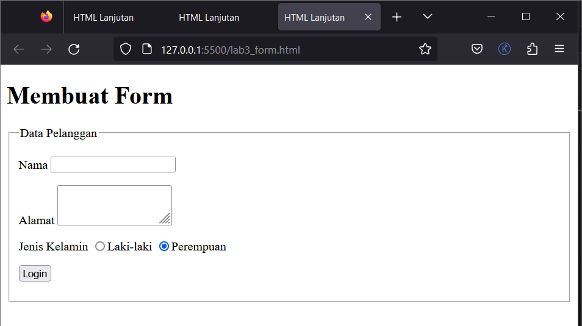
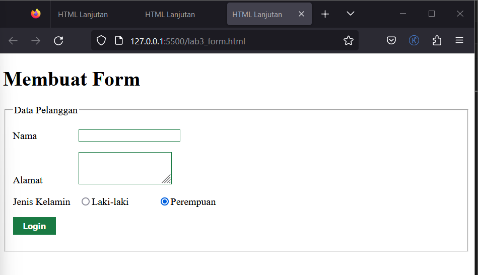
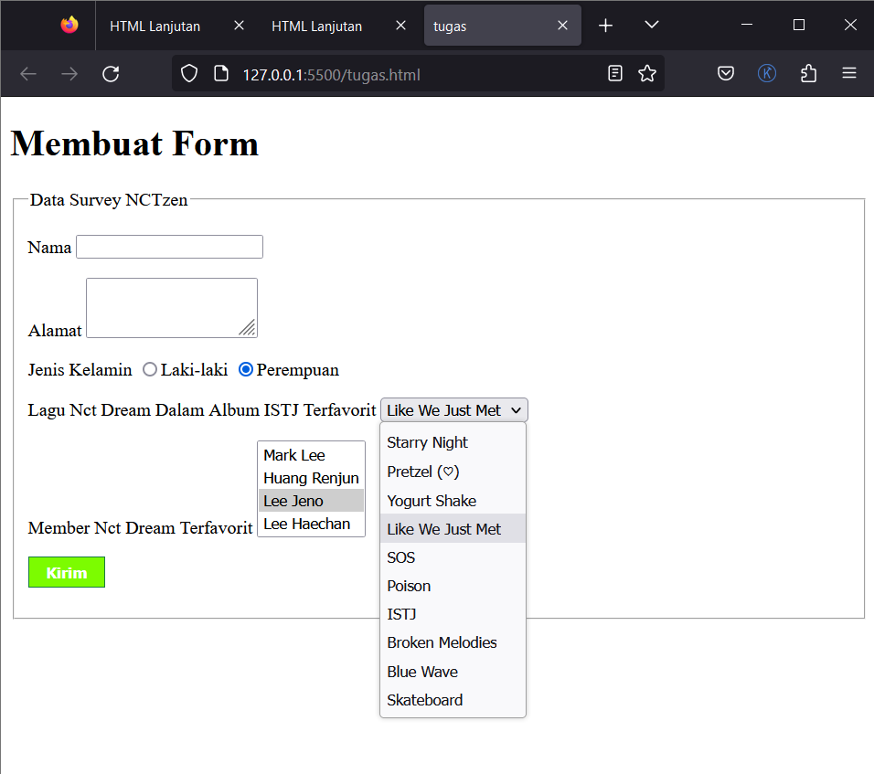

#Praktikum_web_3

`Nama  : Faizah Via Fadhillah`

`Nim   : 312210460`

`Kelas : TI22.A4`

# Praktikum 3

1. Membuat Ordered List

    Script :

    ```html
    <section id="order-list">
        <h2>Ordered List</h2>
        <ol>
            <li>Pemrograman Web</li>
            <li>Sistem Informasi</li>
            <li>Basis Data 2</li>
        </ol>
    </section>
    ```

    Output :

    


2. Membuat Unorderd List

    Script :

    ```html
     <section id="unorder-list">
        <h2>Unordered List</h2>
        <ul type="square">
            <li>Jaringan Komputer</li>
            <li>Struktur Data</li>
            <li>Algoritma &amp; Pemrograman</li>
        </ul>
    </section>
    ```

    Output :

    


3.  Membuat Description List

    Script :

    ```html
    <section id="unorder-list">
        <h2>Description List</h2>
        <dl>
            <dt>Fakultas Teknik</dt>
            <dd>Teknik Industri</dd>
            <dd>Teknik Informatika</dd>
            <dd>Teknik Lingkungan</dd>
            <dt>Fakultas Ekonomi dan Bisnis</dt>
            <dd>Akuntansi</dd>
            <dd>Manajemen</dd>
            <dd>Bisnis Digital</dd>
        </dl>
    </section>
    ```

    Output :

    


4. Membuat Tabel

    Script :

    ```html
    <table border="1" cellpadding="4" cellspacing="0">
        <thead>
            <tr>
            <th>No.</th>
            <th>Fakultas</th>
            <th>Program Studi</th>
            </tr>
        </thead>
        <tbody>
            <tr>
            <td>1.</td>
            <td>Teknik</td>
            <td>Teknik Informatika</td>
            </tr>
            <tr>
            <td>2.</td>
            <td>Teknik</td>
            <td>Teknik Industri</td>
            </tr>
            <tr>
            <td>3.</td>
            <td>Teknik</td>
            <td>Teknik Lingkungan</td>
            </tr>
        </tbody>
    </table>
    ```

    Output :

    


5.  Mengatur Margin dan Padding

    Script :

    ```html
    <table border="1" cellpadding="4" cellspacing="2">
    ```

    Output :

    


6. Menggabungkan Sel Data

    Script :

    ```html
    <table border="1" cellpadding="6" cellspacing="0">
        <thead>
            <tr>
            <th>No.</th>
            <th>Fakultas</th>
            <th>Program Studi</th>
            </tr>
        </thead>
        <tbody>
            <tr>
            <td>1.</td>
            <td rowspan="3">Teknik</td>
            <td>Teknik Informatika</td>
            </tr>
            <tr>
            <td>2.</td>
            <td>Teknik Industri</td>
            </tr>
            <tr>
            <td>3.</td>
            <td>Teknik Lingkungan</td>
            </tr>
        </tbody>
    </table>
    ```

    Output :

    


7. Membuat Form

    Script HTML:

    ```html
    <form action="proses.php" method="post">
        <fieldset>
        <legend>Data Pelanggan</legend>
        <p>
        <label for="nama">Nama</label>
        <input type="text" id="nama" name="nama">
        </p>
        <p>
        <label for="alamat">Alamat</label>
        <textarea id="alamat" name="alamat" cols="20" rows="3"></textarea>
        </p>
        <p>
        <label>Jenis Kelamin</label>
        <input id="jk_l" type="radio" name="kelamin" value="L" /><label
        for="jk_l">Laki-laki</label>
        <input id="jk_p" type="radio" name="kelamin" value="P" /><label
        for="jk_p">Perempuan</label>
        </p>
        <p><input type="submit" value="Login"></p>
        </fieldset>
    </form>
    ```

    Output :

    


    Script CSS :

    ```css
    form p > label 
    {
        display: inline-block;
        width: 100px;
    }
    form input[type="text"], form textarea 
    {
        border: 1px solid #197a43;
    }
     form input[type="submit"] 
    {
        border: 1px solid #197a43;
        background-color: #197a43;
        color: #ffffff;
        font-weight: bold;
        padding: 5px 15px;
    }
    ```

    Output :

    


# Tugas

    Script :

    ```html
    <p>
        <label for="pilihan">Lagu Nct Dream Dalam Album ISTJ Terfavorit</label>
            <select id="pilihan" name="pilihan">
                <option value="opsi1">Starry Night</option>
                <option value="opsi2">Pretzel (♡)</option>
                <option value="opsi3">Yogurt Shake</option>
                <option value="opsi4">Like We Just Met</option>
                <option value="opsi5">SOS</option>
                <option value="opsi6">Poison</option>
                <option value="opsi7">ISTJ</option>
                <option value="opsi8">Broken Melodies</option>
                <option value="opsi9">Blue Wave</option>
                <option value="opsi10">Skateboard</option>
            </select>
        </p>

        <p>
        <label for="pilihan-multiple">Member Nct Dream Terfavorit</label>
        <select id="pilihan-multiple" name="pilihan-multiple" multiple>
            <option value="opsiA">Mark Lee</option>
            <option value="opsiB">Huang Renjun</option>
            <option value="opsiC">Lee Jeno</option>
            <option value="opsiD">Lee Haechan</option>
            <option value="opsiE">Na Jaemin</option>
            <option value="opsiF">Zhong Chenle</option>
            <option value="opsiG">Park Jisung</option>
        </select>
    </p>
    ```

    Output :

